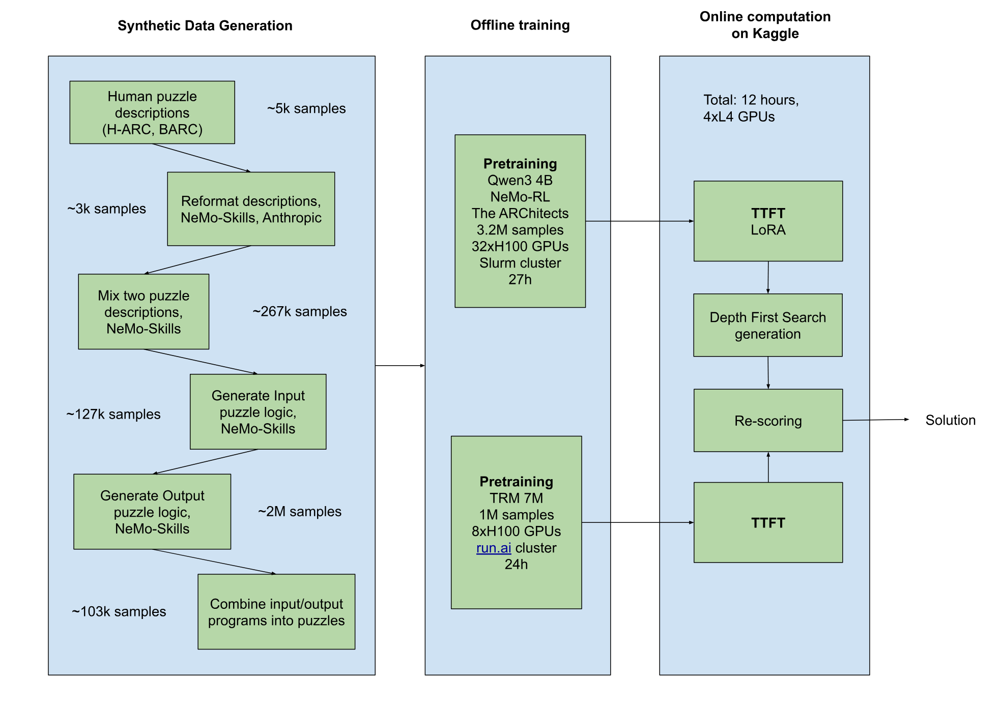
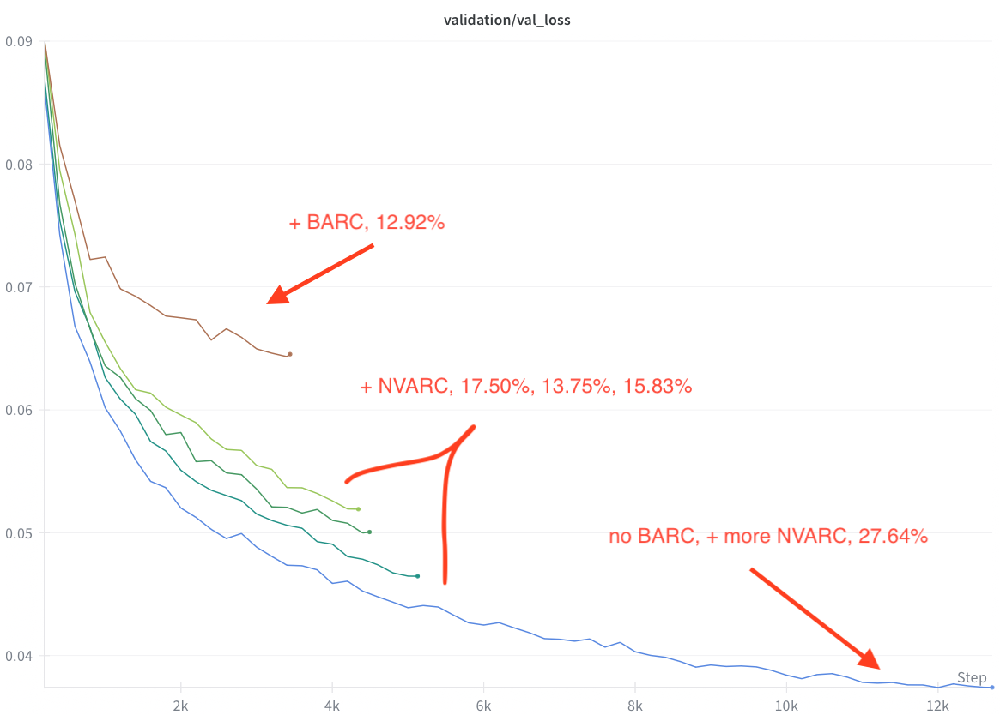

# ARC Prize 2025

> Create an AI capable of novel reasoning

## Competition Classification

| Category | Value |
|----------|-------|
| **Problem Type** | Abstract Reasoning / Program Synthesis |
| **Data Domain** | Structured Grids / Visual Reasoning |
| **ML Approach** | Deep Learning + Test-Time Training |
| **Key Techniques** | Transformer Fine-tuning, Synthetic Data Generation, Program Search |
| **Difficulty** | Expert |

## Competition Overview

| Attribute | Value |
|-----------|-------|
| **Competition Type** | Featured Code Competition |
| **Total Prize** | $1,000,000 |
| **Teams** | 1,554 |
| **Timeline** | March 26, 2025 - November 4, 2025 |
| **Evaluation Metric** | Abstraction and Reasoning Challenge (Percentage of correct predictions) |
| **Host** | Abstraction and Reasoning Corpus |

## Problem Description

The ARC Prize 2025 competition challenges participants to develop AI systems capable of **efficiently learning new skills and solving open-ended problems**, rather than depending exclusively on systems trained with extensive datasets. This is the second ARC Prize competition on Kaggle, building upon ARC Prize 2024 with an updated dataset of human-calibrated problems and increased compute for participants.

### The Core Challenge

Current AI systems cannot generalize to new problems outside their training data, despite extensive training on large datasets. While LLMs have brought AI to the mainstream for known tasks, progress towards Artificial General Intelligence (AGI) remains idea-constrained.

The **Abstraction and Reasoning Corpus for Artificial General Intelligence (ARC-AGI-2)** benchmark measures an AI system's ability to efficiently learn new skills:
- **Humans**: Collectively scored 100% on ARC
- **Best AI systems**: Only score ~4%

The competition encourages researchers to explore ideas beyond LLMs, which depend heavily on large datasets and struggle with novel problems.

---

## Data Description

### Dataset Overview

| File | Size | Description |
|------|------|-------------|
| `arc-agi_training_challenges.json` | ~2 MB | Training tasks with input/output demonstration pairs |
| `arc-agi_training_solutions.json` | ~500 KB | Ground truth outputs for training tasks |
| `arc-agi_evaluation_challenges.json` | ~985 KB | Validation tasks for model evaluation |
| `arc-agi_evaluation_solutions.json` | ~250 KB | Ground truth outputs for evaluation tasks |
| `arc-agi_test_challenges.json` | - | Hidden test tasks (240 tasks used for leaderboard) |
| `sample_submission.json` | ~50 KB | Example submission format |

**Total Dataset Size**: 6.91 MB
**License**: CC0: Public Domain

### Task Structure

Each ARC task is a JSON object containing:

```json
{
  "train": [
    {"input": [[0,0,0],[0,1,0],[0,0,0]], "output": [[1,1,1],[1,0,1],[1,1,1]]},
    {"input": [[0,0],[2,0]], "output": [[2,2],[0,2]]}
  ],
  "test": [
    {"input": [[0,3,0],[0,0,0],[0,0,0]]}
  ]
}
```

- **"train"**: Demonstration input/output pairs (typically 2-5 pairs) showing the transformation pattern
- **"test"**: Test input(s) where the algorithm must predict the output

### Grid Format

A **grid** is a rectangular matrix (list of lists) of integers:
- **Values**: 0-9 (inclusive), visualized as different colors
- **Minimum size**: 1×1
- **Maximum size**: 30×30

### Color Mapping

| Value | Color |
|-------|-------|
| 0 | Black (background) |
| 1 | Blue |
| 2 | Red |
| 3 | Green |
| 4 | Yellow |
| 5 | Gray |
| 6 | Magenta |
| 7 | Orange |
| 8 | Cyan |
| 9 | Brown |

### Example Task Visualization

```
TRAINING EXAMPLE 1:
Input:                    Output:
┌─────────────┐          ┌─────────────┐
│ 0  0  0  0  │          │ 0  0  0  0  │
│ 0  1  1  0  │    →     │ 0  2  2  0  │
│ 0  1  1  0  │          │ 0  2  2  0  │
│ 0  0  0  0  │          │ 0  0  0  0  │
└─────────────┘          └─────────────┘

TRAINING EXAMPLE 2:
Input:                    Output:
┌───────────────────┐    ┌───────────────────┐
│ 0  0  0  0  0  0  │    │ 0  0  0  0  0  0  │
│ 0  0  1  1  1  0  │ →  │ 0  0  2  2  2  0  │
│ 0  0  0  0  0  0  │    │ 0  0  0  0  0  0  │
└───────────────────┘    └───────────────────┘

TEST INPUT (predict the output):
┌─────────────────────────┐
│ 0  0  0  0  0  0  0  0  │
│ 0  0  0  1  1  0  0  0  │
│ 0  0  0  1  1  0  0  0  │
│ 0  0  0  1  1  0  0  0  │
│ 0  0  0  0  0  0  0  0  │
└─────────────────────────┘

Pattern: Replace all blue (1) cells with red (2) cells
```

### Key Dataset Characteristics

1. **Novel reasoning required**: Each task has a unique transformation rule that must be inferred from examples
2. **No memorization possible**: Test tasks are completely unseen and cannot be solved by pattern matching from training
3. **Variable complexity**: Tasks range from simple color swaps to complex spatial reasoning
4. **Human-calibrated**: All tasks are solvable by humans, establishing a benchmark for machine reasoning

### Submission Format

Submissions must be a JSON file named `submission.json`:

```json
{
  "task_id_1": [
    {"attempt_1": [[0, 0], [0, 0]], "attempt_2": [[1, 1], [1, 1]]}
  ],
  "task_id_2": [
    {"attempt_1": [[2, 2, 2]], "attempt_2": [[3, 3, 3]]},
    {"attempt_1": [[4, 4]], "attempt_2": [[5, 5]]}
  ]
}
```

**Requirements**:
- **2 attempts per output** (`attempt_1`, `attempt_2`)
- Both attempts must be present even if only one prediction exists
- Tasks with multiple test outputs require predictions in the same order as inputs
- All task_ids from the challenge file must be present

---

## Evaluation

For each task output:
- If **either** of the 2 predicted outputs matches the ground truth **exactly** (all cells match) → score 1
- Otherwise → score 0
- **Final score** = sum of highest score per task output ÷ total number of task test outputs

### Scoring Details

- **Exact match required**: Every cell in the predicted grid must match the ground truth
- **Grid dimensions matter**: Height and width must be correct
- **Two attempts per puzzle**: Allows for uncertainty in predictions

---

## Prize Structure

### Progress Prizes ($125,000)
| Place | Prize |
|-------|-------|
| 1st | $25,000 |
| 2nd | $10,000 |
| 3rd | $5,000 |
| 4th | $5,000 |
| 5th | $5,000 |

### Paper Award Prizes ($75,000)
| Place | Prize |
|-------|-------|
| Winner | $50,000 |
| First Runner Up | $20,000 |
| Second Runner Up | $5,000 |

### Grand Prize ($700,000)
Unlocked if any team achieves **≥85% accuracy**:
| Place | Prize |
|-------|-------|
| 1st | $350,000 |
| 2nd | $150,000 |
| 3rd | $70,000 |
| 4th | $70,000 |
| 5th | $60,000 |

---

## Top Solutions

### 1st Place: NVARC (Score: ~28%)

**Team**: Ivan Sorokin, CPMP

#### Solution Architecture Overview



*Figure 1: NVARC end-to-end pipeline showing three main phases: (1) Synthetic Data Generation starting from ~5k human puzzle descriptions, expanding through mixing and code generation to ~103k final puzzles; (2) Offline Training with Qwen3 4B using The ARChitects approach (3.2M samples, 32×H100 GPUs, 27 hours) and TRM 7M (1M samples, 8×H100 GPUs, 24 hours); (3) Online Computation on Kaggle with Test-Time Fine-Tuning (TTFT) using LoRA, Depth First Search generation, and re-scoring (12 hours total on 4×L4 GPUs).*

#### Key Components

**1. Multi-stage Synthetic Data Generation Pipeline**

| Stage | Input | Output | Method |
|-------|-------|--------|--------|
| Collect descriptions | H-ARC, BARC datasets | ~5k samples | Human puzzle descriptions |
| Reformat | Raw descriptions | ~3k samples | NeMo-Skills, Anthropic |
| Mix summaries | Two descriptions | ~267k samples | LLM combines elements |
| Generate input logic | Puzzle description | ~127k samples | Python code + unit tests |
| Generate output logic | Input logic + description | ~2M samples | Python transformation code |
| Filter & combine | All programs | ~103k puzzles | Consistency validation |

- Used `gpt-oss-120b` model via NeMo-Skills framework
- Generation throughput: 15k tokens/s on 8×H100 GPUs
- Final dataset: 103,253 filtered puzzles with consistent outputs

**2. Improved ARChitects Approach**

Training data composition (3.2M augmented samples):

| Source | Unique Puzzles | Augmented Samples/Puzzle | Total Samples | Share |
|--------|---------------|-------------------------|---------------|-------|
| MINI-ARC | 147 | 256 | 37,632 | 1.2% |
| ConceptARC | 160 | 256 | 40,960 | 1.3% |
| RE-ARC | 400 | 256 | 102,392 | 3.2% |
| ARC-AGI-2 | 609 | 256 | 155,904 | 4.8% |
| NVARC training | 47,337 | 24 | 1,132,633 | 34.8% |
| NVARC full | 55,886 | 32 | 1,785,960 | 54.9% |
| **Total** | **104,539** | - | **3,255,481** | - |

**Key innovations**:
- Simplified dialog-style template using only 16 tokens
- LoRA test-time fine-tuning (r=256, alpha=32)
- Batch Depth First Search (DFS) decoding with deterministic inference
- 8 augmentations per candidate for scoring

**3. Training Progress**



*Figure 2: Validation loss curves during pretraining showing the impact of different synthetic data configurations. The graph demonstrates how adding more NVARC synthetic data dramatically improves performance: baseline with BARC achieves 12.92%, adding NVARC improves to 15-17%, and the final configuration without BARC but with maximum NVARC data achieves 27.64% on the public leaderboard.*

**4. Tiny Recursive Model (TRM) Integration**
- Pretrained TRM, then fine-tuned on test data during submission
- Optimized for Kaggle runtime: 4 H cycles, 10 halt max steps, 2000 epochs
- Standalone TRM: 10.0% (4k epochs, <4 hours)
- Ensemble with Qwen3 2B: improved 21.53% → 22.50%

#### Key Insights
- Scaling pretraining with quality synthetic puzzles was crucial
- Synthetic data with Python programs enables reproducible puzzle generation
- TRM adds unique puzzle-solving capability not captured by transformer models alone

#### Resources
- [GitHub: NVARC Source Code](https://github.com/1ytic/NVARC)
- [Kaggle Dataset: NVARC Synthetic Puzzles](https://www.kaggle.com/datasets/sorokin/nvarc-synthetic-puzzles)
- [Kaggle Dataset: NVARC Artifacts Puzzles](https://www.kaggle.com/datasets/sorokin/nvarc-artifacts-puzzles)

---

### 3rd Place: MindsAI & Tufa Labs (Score: 15.42%)

**Team**: Jack Cole (lead), Dries Smit, Isaiah Pressman, Mohamed Osman, Michael Hodel

#### Architecture

- **Base Model**: 660M-parameter encoder-decoder derived from **Salesforce CodeT5-Large**
- **Encoder**: 24 layers (kept from original)
- **Decoder**: 16 layers (pruned from original 24)
- **Training Data**: >100 million reasoning examples (~70M ARC-style tasks)

#### Core Techniques

**1. Test-Time Training (TTT)**
- ~45k steps of permutation-based labeling per test puzzle
- Adapts the model specifically to each puzzle's characteristics
- Introduced by this team in 2023, now standard across top solutions

**2. Augment-Inference-Reverse-Vote (AIRV)**
- 10k augmented inferences per task
- Applies geometric and color augmentations
- Aggregates predictions via voting mechanism

**3. Data Augmentation Strategy**

| Rank | Augmentation | Impact |
|------|-------------|--------|
| 1 | Geometric (rotations/flips) + color permutations | Baseline essential |
| 2 | Mixup, Combine, Combine-mixup (New 2025) | +6.3% top-2 on ARC 1.5 |
| 3 | Input/output swap (30% of training) | Small improvement |
| 4 | Prompt/answer reversals | Model flexibility |
| 5 | BPE tokenizer dropout | Small improvement |

#### Key Findings

1. **TTT + AIRV gains are nearly perfectly additive** (~8-12% combined vs ~4% each alone)
2. **Self-ensembling** with different seeds beats using 2× more TTT/AIRV samples
3. **Encoder depth >> decoder depth** (removing encoder layers hurts badly; decoder can be heavily pruned)
4. Augmentation-driven data expansion can break multi-month training plateaus
5. ARC-AGI-2 appears partially adversarial to the TTT/AIRV paradigm

#### Training Resources

| Component | Hardware | Time |
|-----------|----------|------|
| Full 660M training | Google TPUs | Many months to 2.5 years cumulative |
| 77M ablation model | TPU v2-8/v3-8 + v4-64 | ~2 years + 7 days |
| Final submission inference | 4× L4 GPUs (Kaggle) | ~11 hours |
| Simplified 77M single-run | Single P100 | 10-60 minutes |

#### Resources
- [GitHub: MindsAI Solution](https://github.com/jcole75/arc_2025_mindsai)
- [Full Writeup PDF](https://github.com/jcole75/arc_2025_mindsai/blob/main/MindsAI_Tufa_Labs_2025_Solution.pdf)
- [HuggingFace Dataset: arc-agi-mega](https://huggingface.co/datasets/mindware/arc-agi-mega)
- [Paper: arXiv:2506.14276](https://arxiv.org/abs/2506.14276)

---

### 5th Place: Search and Learn Approach

**Author**: Guillermo Barbadillo

#### Approach
- Deep-learning-guided **program synthesis** system
- Searches program space with **test-time training via hindsight relabeling**
- Tight search-and-learn loop

#### Key Finding
- Search-and-learn outperforms pure search approaches for the same number of predictions per task
- However, the approach did not yet solve any private test tasks from ARC-AGI-2
- Best result achieved with adaptations of last year's transduction + test-time training approach

#### Resources
- [Full Solution Documentation](https://ironbar.github.io/arc25/05_Solution_Summary/)

---

## Common Winning Strategies

### 1. Test-Time Training (TTT)
Adapting models specifically to each test puzzle using augmented training examples generated from the puzzle's demonstration pairs.

### 2. Synthetic Data Generation
Creating millions of ARC-style puzzles programmatically:
- Mix existing puzzle descriptions to create novel combinations
- Generate Python code for input/output transformations
- Filter for consistency and validity

### 3. Heavy Augmentation
- **Geometric**: Rotations (90°, 180°, 270°), horizontal/vertical flips
- **Color permutations**: Randomly remap color values
- **Mixup/Combine**: Merge elements from different puzzles
- **Reversal**: Swap input/output roles during training

### 4. Ensemble Methods
- Combine predictions from multiple model checkpoints
- Self-ensembling with different random seeds
- Aggregate via voting or probability-weighted selection

### 5. Program Synthesis
- Generate code representations of transformations
- Use domain-specific languages (DSLs) for ARC primitives
- Search through program space guided by learned models

### 6. Encoder-Heavy Architectures
- Strong encoding of input patterns more important than decoder capacity
- Encoder depth matters significantly; decoder can be pruned aggressively

---

## Technical Requirements

### Kaggle Notebook Constraints

| Requirement | Limit |
|-------------|-------|
| CPU Runtime | ≤12 hours |
| GPU Runtime | ≤12 hours |
| Internet Access | Disabled |
| External Data | Allowed (including pre-trained models) |

### Upgraded Accelerators
- **L4×4 machines** available for this competition
- 96GB GPU memory total
- Quota usage: 2× rate of T4×2 and P100 machines
- Restricted to notebooks attached to this competition only

---

## Solution Links

| Place | Team | Score | Solution |
|-------|------|-------|----------|
| 1st | NVARC | ~28% | [Writeup](https://www.kaggle.com/c/arc-prize-2025/writeups/nvarc) |
| 3rd | MindsAI & Tufa Labs | 15.42% | [Writeup](https://www.kaggle.com/c/arc-prize-2025/writeups/mindsai-and-tufa-labs-arc-prize-2025-solution) |
| 4th | - | - | [Writeup](https://www.kaggle.com/c/arc-prize-2025/writeups/arc-prize-2025-competition-writeup-5th-place) |
| 5th | Guillermo Barbadillo | - | [Writeup](https://www.kaggle.com/c/arc-prize-2025/writeups/exploring-the-combination-of-search-and-learn-for) |
| 6th | - | - | [Writeup](https://www.kaggle.com/c/arc-prize-2025/writeups/lb10-00-with-small-change-to-2024architects) |

---

## Citation

```bibtex
@misc{arc-prize-2025,
    author = {Francois Chollet and Mike Knoop and Greg Kamradt and Walter Reade and Addison Howard},
    title = {ARC Prize 2025},
    year = {2025},
    howpublished = {\url{https://kaggle.com/competitions/arc-prize-2025}},
    note = {Kaggle}
}
```
